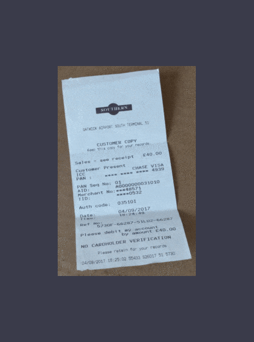

# [RectiNet](https://arxiv.org/abs/2007.09824)
[](https://paperswithcode.com/sota/ssim-on-docunet?p=a-gated-and-bifurcated-stacked-u-net-module)

## A Gated and Bifurcated Stacked U-Net Module for Document Image Dewarping

Capturing images of documents is one of the easiest
and most used methods of recording them. These images however,
being captured with the help of handheld devices, often lead to
undesirable distortions that are hard to remove. We propose
a supervised Gated and Bifurcated Stacked U-Net module to
predict a dewarping grid and create a distortion free image
from the input. While the network is trained on synthetically
warped document images, results are calculated on the basis of
real world images. The novelty in our methods exists not only in
a bifurcation of the U-Net to help eliminate the intermingling of
the grid coordinates, but also in the use of a gated network which
adds boundary and other minute line level details to the model.
The end-to-end pipeline proposed by us achieves state-of-the-art
performance on the DocUNet dataset after being trained on just
8 percent of the data used in previous methods.

---
<p align="center">
  
</p>


### Demo 
[](https://colab.research.google.com/drive/1aBFOIAZ5JHaoQsw4ihC0usZP0ZI-jlLE?usp=sharing)
### Requirements

Required packages:
- torch (>1.4.0)
- torchvision (>0.6.0)
- numpy (>1.18.4)

To install all required packages, use 
`pip install -r requirements.txt`

### Training the model

Required Directory Structure:
```

.
+-- data_gen
|   +-- .
|   +-- image
|   +-- label
|   +-- image_test
+-- model_save
|   +-- .
+-- loader
|   +-- .
|   +-- __init__.py
|   +-- dataset.py
+-- predict
|   +-- .
|   +-- model_pred.py
|   +-- predict.py
+-- unets
|   +-- .
|   +-- __init__.py
|   +-- Punet.py
|   +-- Sunet.py
+-- utils
|   +-- .
|   +-- __init.py
|   +-- GCN.py
|   +-- plot_me.py
|   +-- utils_model.py
+-- model.py
+-- train.py

```
- Run:
`python3 train.py --batch-size 16`
- For custom location of training data run:
`python3 train.py --batch-size 16 --data-path PATH_TO_DATA`
- For more parameters run:
` python3 train.py -help`


### Dense Grid Prediction and Image Unwarp

- In same directory:
` mkdir save`
- Navigate to predict directory
` cd predict/ `
  - For predicting single image:
` python3 predict.py --save-path ../save --img-path IMAGE_PATH --model-path ../model_save/SAVED_MODEL_PATH --multi=False`
  - For predicting many image in a folder:
` python3 predict.py --save-path ../save --img-path IMAGE_FOLDER_PATH --model-path ../model_save/SAVED_MODEL_PATH --multi=True`
- For more parameters:
` python3 predict.py -help`


### Generating data

   For generating your own dataset, follow [this repository](https://github.com/XiyanLiu/AGUN). Do note, they use pkl to save the ground truth dense grid while I make use of npz. To get save arrays as npz, just change the way the grid is saved in the generation code.
   
### Note:
- Please note that we used Matlab 2018b for implementing SSIM (Structural Similarity Index) and MS-SSIM ( Multi-Scale Structural Similarity Index) values. Matlab 2020a, however, uses a different SSIM implementation. Do take that into consideration while comparing your results with the values in our paper. 
- Please use the 'Discussion' option to ask questions about the code instead of raising an issue -- unless it has something to do with an error in the code.


### Loading pre-trained Model

- Download model weights [here](https://drive.google.com/file/d/1Q_cWtIX-quCizX8huznfcIYJKxCOkTSZ/view?usp=sharing "RectiNet Weights")
- Save under `model_save` folder
- Run:
` python3 predict.py --save-path save --img-path IMAGE_PATH --model-path model_save/weights.pt --multi=False`

### Citation

If you use this code please consider citing :
```
@misc{b2020gated,
    title={A Gated and Bifurcated Stacked U-Net Module for Document Image Dewarping},
    author={Hmrishav Bandyopadhyay and Tanmoy Dasgupta and Nibaran Das and Mita Nasipuri},
    year={2020},
    eprint={2007.09824},
    archivePrefix={arXiv},
    primaryClass={cs.CV}
}
```

### Todo

- [X] Upload pre-trained weights for predictions
- [ ] Upload Images for Evaluation
- [ ] Increase code readability
